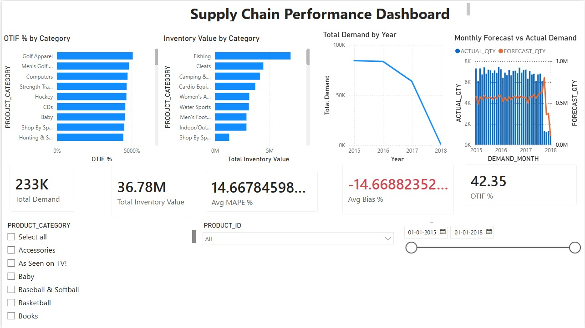

# Supply Chain Analytics – End-to-End Analytics Pipeline

## 📌 Project Overview
This project demonstrates an end-to-end **Supply Chain Analytics pipeline** using **Python (ETL)**, **Snowflake SQL**, and **Power BI**.  
The goal is to automate data ingestion, standardize raw operational data, calculate key supply chain KPIs, and deliver interactive dashboards for business decision-making.

---

## 🏗️ Architecture
**Data Flow:**
1. Raw CSV files (Sales, Demand, Inventory, Fulfillment)
2. Python ETL for validation & standardization
3. Snowflake for analytical transformations
4. Power BI for modeling, KPIs, and dashboards

---

## 🔧 Tech Stack
- **Python** – Data cleaning, schema validation, automation
- **Snowflake SQL** – Aggregations, demand calculations
- **Power BI** – Dimensional modeling & dashboards
- **Git/GitHub** – Version control

---

## 📊 Key Metrics & KPIs
- **Total Demand**
- **Forecast vs Actual Demand**
- **MAPE (%)**
- **Forecast Bias (%)**
- **OTIF (%)**
- **Inventory Value**
- **Inventory Turnover**

---

## 📁 Project Structure
data/
├── department/ # Raw source files
├── clean/ # Cleaned datasets

etl/
├── validate_and_standardize.py

snowflake_sql/
├── 01_demand_monthly.sql

---

## 🔁 Automation
- Python scripts automate data validation & cleaning
- Snowflake SQL creates analytical tables
- Power BI refreshes data from a folder-based pipeline

---

## 📈 Dashboard Highlights
- Forecast vs Actual trend analysis
- OTIF performance by product category
- Inventory value & demand trends over time
- Interactive filters by date and product

## 📊 Dashboard Preview

---

## 🎯 Business Impact
This solution enables:
- Faster decision-making
- Early detection of forecast inaccuracies
- Inventory optimization
- Improved service-level tracking

---

## 👤 Author
**Sajal Jain**  
MS in Business Analytics  
